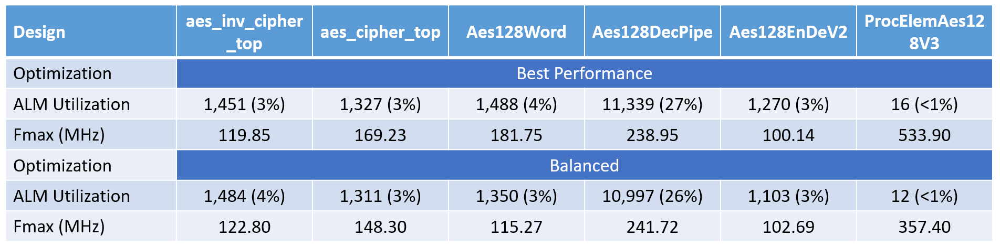
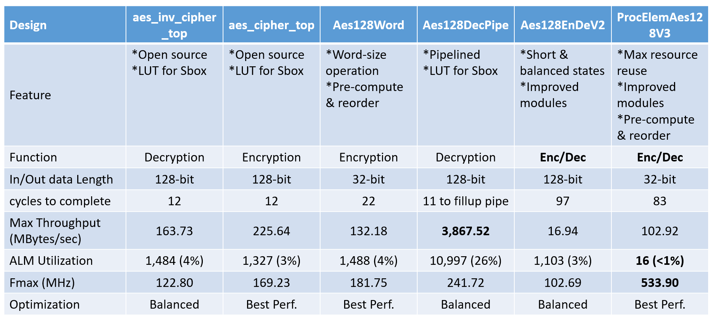
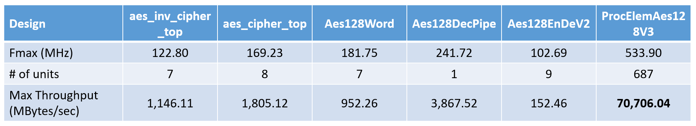

# A Compact AES-128 Design
The table shows different design architectures of AES-128 and introduces a very compact and highly area optimization design which can provide a very high computation throughput over a traditional pipelined architecture.
 
 

Algorithm
------
[Advanced Encryption Standard (AES) Algorithm](https://nvlpubs.nist.gov/nistpubs/FIPS/NIST.FIPS.197.pdf)
 
 

Development Tool
------
Intel Quartus Prime Standard 18.1
 

Platform
------
[ARROW SoCKit](https://www.arrow.com/en/products/sockit/arrow-development-tools)
* Cyclone V SoC 5CSXFC6D6F31C8NES ver.B
* Dual-core ARM Cortex-A9 (HPS)
* 110K Programmable Logic Elements
* 5,140 Kbits embedded memory
 

Comparison
------
Here is a quick shot to show all design sizes and Fmax values after applying different optimization efforts. 
Normally, the decryption design is more complicated than the encryption one so the size is larger and the Fmax is lower. Notice the compilation effort of "Best Performance" does not always guarantee the best Fmax.

    Fig1. The Fmax of different optimization modes

The *aes_inv_cipher_top* and *aes_cipher_top* are open source from website. 

The *Aes128Word* runs enryption flow and most operations inside uses 32-bit data, not the full 128-bit data. Since the input/output data is limited to only 32 bits, it requires more clock cycles to load key and plaintext and requires some cycles to output a full ciphertext. The strategy to reduce design size by this little change with a pre-computed input does not provide a good result. This Fmax does not improve as well.

The *Aes128DecPipe* is a fully pipelined architecture for decryption computation. This design can pop one plaintext per clock after pipe is filled so the throughput is the best and the size is much larger than others.

The *Aes128EnDeV2* is a design trying to merge encryption and decryption into one design so many resource can be shared somehow. 

    Fig2. Overall comparison of different AES designs

    Fig3. The max throughput comparison after aligning resource utilization

